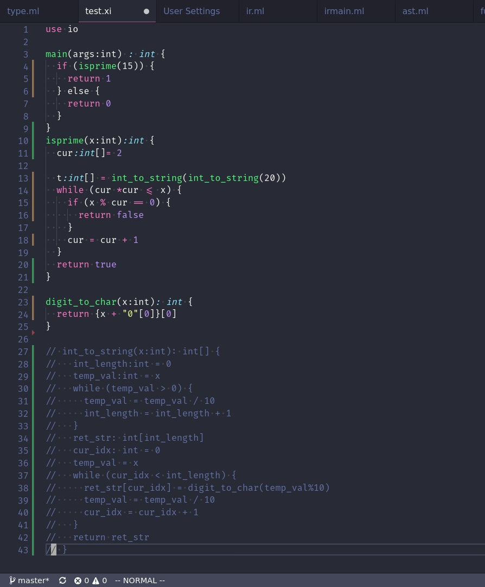

# vscode-xi
VSCode Xi language support.

For the Xi language for Cornell's CS 4120 compilers course.

Features:
* Commenting
* Parens autoclosing
* Syntax Highlighting

[Xi Language](http://www.cs.cornell.edu/courses/cs4120/2018sp/)

